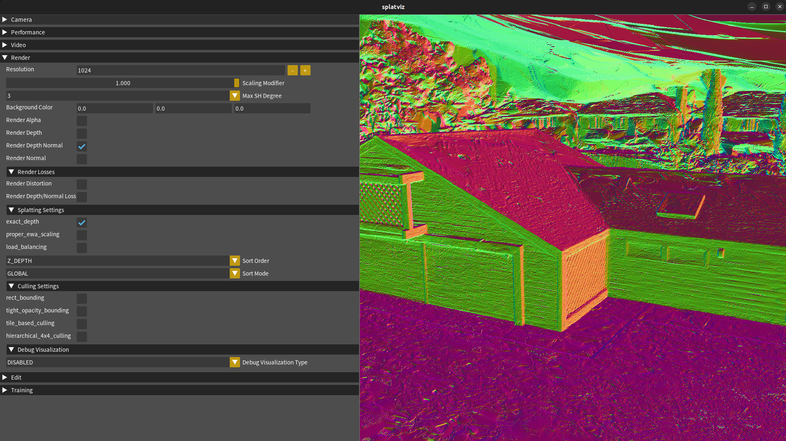

<h1 align="center">SOF: Sorted Opacity Fields for Fast Unbounded Surface Reconstruction</h1>

<p align="center">
  <a href="https://r4dl.github.io/SOF/">
    
  </a>
  <a href="https://arxiv.org/abs/2506.19139">
    
  </a>
  <a href="https://cloud.tugraz.at/index.php/s/a2pjZCyDH4sASdL">
    
  </a>
  <a href="https://cloud.tugraz.at/index.php/s/ZEs5rje9rs2TpEo">
    
  </a>
</p>

<h3 align="center">SIGGRAPH Asia 2025</h3>

<h4 align="center">
    <a href="https://r4dl.github.io/">Lukas Radl</a><sup>1</sup> ·
    <a href="https://scholar.google.com/citations?user=J_Jm3Y4AAAAJ&hl=en">Felix Windisch</a><sup>1</sup> ·
    <a href="https://scholar.google.com/citations?user=CDy95WwAAAAJ&hl=en">Thomas Deixelberger</a><sup>2</sup> ·
    <a href="https://scholar.google.com/citations?user=q3KITmQAAAAJ&hl=en">Jozef Hladky</a><sup>2</sup> ·
    <a href="https://steimich96.github.io/">Michael Steiner</a><sup>1</sup> ·
    <a href="https://www.vis.uni-stuttgart.de/en/team/Schmalstieg/">Dieter Schmalstieg</a><sup>1,3</sup> ·
    <a href="https://www.markussteinberger.net/">Markus Steinberger</a><sup>1,2</sup>
</h4>

  <div align="center">
    <p>
      <sup>1</sup> Graz University of Technology 🇦🇹<br>
      <sup>2</sup> Huawei Technologies 🇦🇹🇨🇭<br>
      <sup>3</sup> University of Stuttgart 🇩🇪
    </p>
  </div>

## Overview

**SOF** is a method for **rapid extraction of unbounded surfaces**, using 3D Gaussians. Compared to recent methods, we deliver improved mesh quality, with more details, while accelerating both training and meshing significantly.

<div align="center">
  
</div>

## Code

Find all instructions for running our code here!

<details>
<summary><strong>Setup</strong></summary>

```bash
# Clone the repository
git clone https://github.com/r4dl/SOF.git
cd SOF

# Create a conda environment
conda env create --file environment.yml
conda activate sof

# Install the remaining dependencies
pip install submodules/simple-knn/ --no-build-isolation
pip install submodules/diff-gaussian-rasterization/ --no-build-isolation
pip install git+https://github.com/rahul-goel/fused-ssim/ --no-build-isolation
``` 

> **Note**: `fused-ssim` is optional. If it cannot be installed, `train.py` falls back to the repository's slower Python SSIM implementation.

If you want to extract meshes with *Fast Marching Tetrahedra*, install Tetra-Triangulation, based on [Tetra-NeRF](https://github.com/jkulhanek/tetra-nerf):
```bash
cd submodules/tetra-triangulation

conda install cmake conda-forge::gmp conda-forge::cgal
cmake . -DCMAKE_CUDA_ARCHITECTURES=native
# to build, it might be necessary for building to define the CUDA PATH
# export CPATH=/usr/local/<CUDA_VERSION>/targets/x86_64-linux/include:$CPATH
make
# Note: editable mode is required here
pip install -e . --no-build-isolation

``` 
> We have tested this implementation with **Ubuntu 22.04** and **CUDA 12.2**.

For Linux servers, see [SERVER_SETUP.md](SERVER_SETUP.md) for a `pip`-first install path and a helper script that auto-detects `CUDA_HOME`.

</details> 

<details>
<summary><strong>Data</strong></summary>

For our evaluation, we used the following datasets:

| Dataset Name | Link | Note |
|--------------|------|------|
| Tanks & Temples | [Download](https://huggingface.co/datasets/ZehaoYu/gaussian-opacity-fields/blob/main/TNT_GOF.zip) | ⚠️ **See Instructions below!** |
| DTU | [Download](https://drive.google.com/drive/folders/1SJFgt8qhQomHX55Q4xSvYE2C6-8tFll9) | ⚠️ **See Instructions below!** |
| Mip-NeRF 360 | [Download](http://storage.googleapis.com/gresearch/refraw360/360_v2.zip) | - |
| TNT/DB (NVS) | [Download](https://repo-sam.inria.fr/fungraph/3d-gaussian-splatting/datasets/input/tandt_db.zip) | - |

The links redirects you to a download page!
We assume all data within the `data/` directory for our <strong>scripts</strong> to work. 
If your data lies somewhere else, modify `DATA_DIR` in [scripts/constants.py](scripts/constants.py).
```
data
├── TNT_GOF
│   ├── Barn
│   └── ...
├── DTU
├── tnt_db
└── m360
```

### Tanks & Temples post-install
> **Note**: For Tanks and Temples, additional care needs to be taken!

First, you need to rename `<SCENE>_COLMAP_SfM.log` to `<SCENE>_traj_path.log` for every scene!
Afterwards, visit the [download page for TNT](https://www.tanksandtemples.org/download/). For each scene, download everything and paste into the corresponding scene folder!

> **Now** your setup is good to go!

### DTU post-install
Download both the `SampleSet` and the `Points` from [here](https://roboimagedata.compute.dtu.dk/?page_id=36). See `DTU_GT_DATA` in `scripts/run_dtu.py`.

</details> 

<details>
<summary><strong>Scripts</strong></summary>

We provide scripts to train, mesh/render and evaluate our method, using the same hyperparameters as reported in the paper.

> **Note**: There may be some noise in the final results; for <strong>convenience</strong>, we provide the [point clouds](https://cloud.tugraz.at/index.php/s/a2pjZCyDH4sASdL)/[meshes](https://cloud.tugraz.at/index.php/s/ZEs5rje9rs2TpEo) we used for evaluation in our paper!

```bash
# Training, Meshing (Marching Tets) and Evaluation for Tanks & Temples
python scripts/run_tnt.py
# Training, Meshing (TSDF) and Evaluation for DTU 
python scripts/run_dtu.py    
# Training, Rendering and Evaluation for NVS (Mip-NeRF 360 by default)
python scripts/run_nvs.py 
``` 

> **Note**: To show the results, simple use the corresponding `show_*` script, *e.g.*, `python scripts/show_nvs.py`.

</details> 

<details>
<summary><strong>Training</strong></summary>

To train our method, use the `train.py` script, as in, *e.g.* [StopThePop](https://github.com/r4dl/StopThePop). To document **rasterizer settings**, we use `.json` files, located in the `configs/` directory.

```bash
# SOF default settings
python train.py --splatting_config configs/hierarchical.json -s <path to dataset>
```

> **Note**: Every parameter specified in the `.json` config file can also be individually set or overridden via command line arguments when running `train.py`. For a full list of all options (including those corresponding to fields in the config), see:

```bash
python train.py -h

...
Splatting Settings:
  --sort_mode {GLOBAL,PPX_FULL,PPX_KBUFFER,HIER}
  --sort_order {Z_DEPTH,DISTANCE,PTD_CENTER,PTD_MAX,MIN_Z_BOUNDING}
  --tile_4x4 {64}       only needed if using sort_mode HIER
  ...                  # plus any other config entries...
```
This means that any field from your `configs/hierarchical.json` (or other config) can be set/overwritten on the CLI using the `--field_name value` pattern.
</details> 

<details>
<summary><strong>Meshing</strong></summary>

#### Bounded (such as DTU)
For bounded scenes (such as DTU), we use **TSDF fusion**, which can be run using
```bash
python extract_mesh_tsdf.py -m <MODEL_PATH>
```
> **Note**: By default, we use a `voxel_size` of `0.002`, but it can be modified via `--voxel_size`.

As a result, you will get the ply-file in `<MODEL_PATH>/test/ours_30000/tsdf.ply`.


#### Unbounded (such as Tanks & Temples)
Here, we use **Fast Marching Tetrahedra**, which are run using
```bash
python extract_mesh_tets.py -m <MODEL_PATH>
```
As a result, you will get the ply-file in `<MODEL_PATH>/test/ours_30000/mesh_faster_binary_search_7.ply`.

> **Note**: To use the `STP` bounding mode, or the *opacity cutoff*, use the CLI (show options with `python extract_mesh_tets.py -h`).

> **Note**: You can (and should) inspect these meshes using our mesh viewer (`python mesh_viewer.py <PATH TO PLY FILE>`). See the [Visualization & Debugging](#visualization--debugging) section below for more details.

</details> 

<details>
<summary><strong>Evaluation</strong></summary>

#### Meshing
All evaluataion scripts for meshing are contained in `mesh_utils/`.
##### Tanks & Temples
To evaluate your meshes for the Tanks & Temples dataset, use
```bash
python mesh_utils/eval_TNT.py \
--dataset-dir <DATASET> \
--ply-path <PATH TO MESH> \
--traj-path <TRAJ PATH LOG FILE> \
--out-dir <OUT DIR>
```
> **Note**: For the `<TRAJ PATH LOG FILE>`, we used the `<SCENE>_COLMAP_SfM.log` file you get from the [TNT_GOF download](https://huggingface.co/datasets/ZehaoYu/gaussian-opacity-fields/blob/main/TNT_GOF.zip); see [Data](#data) for details.

##### DTU
To evaluate your meshes for the DTU dataset, use
```bash
python mesh_utils/eval_DTU.py \
--instance_dir <PATH TO SCAN> \
--input_mesh <PATH TO MESH> \
--dataset_dir <PATH TO GT DATA> \
--vis_out_dir <OUT DIR>
```
> **Note**: The `GT DATA` needs to be downloaded separately from [here](https://roboimagedata.compute.dtu.dk/?page_id=36); see [Data](#data) for details. 

#### Novel View Synthesis

To evaluate novel view synthesis, run
```bash
# render images
python render.py -m <MODEL DIRECTORY> --skip_train
# create metrics
python metrics.py -m <MODEL DIRECTORY>
```
This is the exact same workflow as in `scripts/run_nvs.py`.

Alternatively, you can also adapt the `run_nvs.py` script.

> **Note**: By default, we run Mip-NeRF 360 using the default settings; to modify this, modify the script:

```python
# modify these to test a different dataset
scenes = ...
factors = ...
TRAIN_DATA = ...
```

</details> 

<details>
<summary><strong>Metrics</strong></summary>

These are the results for the latest run, using this codebase!

> **Note**: The numbers may vary slightly per-run, and this is not the original codebase we used; altough a cleaned-up version!

#### Meshing

> *Table: DTU evaluation*

| Scan | 24    | 37    | 40    | 55    | 63    | 65    | 69    | 83    | 97    | 105   | 106   | 110   | 114   | 118   | 122   | Average |
|--------|-------|-------|-------|-------|-------|-------|-------|-------|-------|-------|-------|-------|-------|-------|-------|-------|
| CD  | 0.557 | 0.775 | 0.567 | 0.395 | 1.235 | 0.813 | 0.708 | 1.172 | 1.263 | 0.670 | 0.728 | 0.968 | 0.503 | 0.589 | 0.521 | **0.764** |

> *Table: TNT evaluation*

| Metric    | Barn | Caterpillar | Courthouse | Ignatius | Meetingroom | Truck | Average |
|-----------|------|-------------|------------|----------|-------------|-------|---------|
| **F-Score** | 0.533 | 0.403 | 0.293 | 0.708 | 0.298 | 0.553 | **0.465** |

> **Note**: Use the `show_dtu.py` and `show_tnt.py` script to quickly get the metrics (after the corresponding `run`-script)!

#### Novel View Synthesis

> *Table: Mip-NeRF 360 evaluation*

| Metric | bicycle | bonsai | counter | flowers | garden | stump | treehill | kitchen | room | **Average** |
|--------|---------|--------|---------|---------|--------|-------|----------|---------|------|-------------|
| **PSNR**  | 25.409 | 31.194 | 28.475 | 21.633 | 27.154 | 26.936 | 22.461 | 30.311 | 29.899 | **27.052** |
| **SSIM**  | 0.784  | 0.933  | 0.898  | 0.636  | 0.862  | 0.789  | 0.643  | 0.910  | 0.907 | **0.818** |
| **LPIPS** | 0.185  | 0.197  | 0.204  | 0.278  | 0.109  | 0.197  | 0.279  | 0.143  | 0.222 | **0.202** |
| **FLIPS** | 0.158  | 0.091  | 0.111  | 0.217  | 0.125  | 0.146  | 0.183  | 0.108  | 0.116 | **0.139** |

> **Note**: Use the `show_nvs.py` to quickly get the metrics (after the `run_nvs`-script)!

</details> 

<details>
<summary><strong>Visualization & Debugging</strong></summary>

Our visualization suite is built upon [Splatviz](https://github.com/Florian-Barthel/splatviz), and is fully self-contained within this repository.
To use it, first navigate to the `splatviz/` directory.

In it, run either
```bash
# to attach to a currently running training session
python run_main.py --mode attach {--port <PORT>}


# to attach to a currently running training session
python run_main.py --data_path <PATH TO A POINT CLOUD FILE>
```

With <strong>both</strong> (yes, both), open the `Render` tab to checkout different debug visualization modes (e.g. Depth/Normal/Transmittance), change rasterizer settings on the fly or just inspect the current scene.
<p align="center">
  
</p>

#### Inspecting Meshes
We additionally provide a **mesh viewer** to inspect triangulated meshes. To run, simply do
```bash
python mesh_viewer.py <PATH TO PLY FILE>
```
By default, normals are displayed. Checkout the CLI for more information! 

</details> 

## Licensing

This code has been built on top of <a href="https://github.com/r4dl/StopThePop">StopThePop</a>, and as such, is primarily licensed under the  <a href="LICENSE.md">"Gaussian Splatting License"</a>.
For more information, we refer to our <a href="NOTICE.md">Notice</a>.

## Acknowledgements

This research was supported by the <strong>Austrian Science Fund (FWF)</strong> [10.55776/I6663], the <strong>German Science Foundation (DFG)</strong> [contract 528364066] and the <strong>Alexander von Humboldt Foundation</strong> funded by the German Federal Ministry of Research, Technology and Space.

<section class="section" id="BibTeX">
  <div class="container is-max-desktop content">
    <h2 class="title">BibTeX</h2>
    <pre><code>@inproceedings{radl2025sof,
  author    = {Radl, Lukas and Windisch, Felix and Deixelberger, Thomas and Hladky, Jozef and Steiner, Michael and Schmalstieg, Dieter and Steinberger, Markus},
  title     = {{SOF: Sorted Opacity Fields for Fast Unbounded Surface Rconstruction}},
  booktitle = {SIGGRAPH Asia Conference Proceedings},
  year      = {2025}
}</code></pre>
  </div>
</section>
